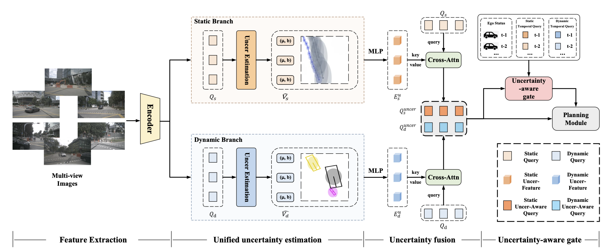

# UniUncer: Unified Dynamic–Static Uncertainty for End-to-End Driving

Official implementation of **[UniUncer: Unified Dynamic–Static Uncertainty for End-to-End Driving](https://arxiv.org/abs/2603.07686v2)**.

> UniUncer is built on top of [SparseDrive](https://arxiv.org/abs/2405.19620) (ICRA 2026). We extend the sparse-centric end-to-end driving pipeline with lightweight, unified uncertainty estimation for both static and dynamic scene elements.

---

## Introduction

End-to-end autonomous driving pipelines treat perception outputs as deterministic, leaving planning vulnerable to noisy or ambiguous inputs. UniUncer introduces three lightweight components to address this:

1. **Unified Uncertainty Estimation** — We convert deterministic regression heads in both static (map) and dynamic (agent) branches into probabilistic Laplace regressors that output per-vertex location and scale.
2. **Uncertainty Fusion** — Static and dynamic Laplace parameters are encoded and fused into the original queries to form uncertainty-aware representations for downstream planning.
3. **Uncertainty-Aware Gate** — An adaptive gating mechanism modulates reliance on historical ego status and temporal perception queries based on current uncertainty levels.

The design adds minimal overhead (~0.5 FPS drop) and is plug-and-play for common sparse E2E backbones.

<p align="center">
  
</p>

---

## Main Results

### Open-loop Planning on nuScenes

| Method | L2 (m) 1s | L2 (m) 2s | L2 (m) 3s | L2 (m) Avg | Col. (%) 1s | Col. (%) 2s | Col. (%) 3s | Col. (%) Avg | FPS |
| :---: | :---: | :---: | :---: | :---: | :---: | :---: | :---: | :---: | :---: |
| SparseDrive-S | 0.29 | 0.58 | 0.96 | 0.61 | 0.01 | 0.05 | 0.18 | 0.08 | 9.0 |
| **UniUncer (Ours)** | **0.27** | **0.53** | **0.90** | **0.57** | **0.00** | **0.04** | **0.17** | **0.07** | 8.5 |

### Pseudo Closed-Loop on NavsimV2

- **EPDMS** improved by **10.8%** over the baseline, with notable gains in interaction-heavy scenes.

## Reproduction Results

The open-loop planning results below are reproduced from `training_records/20260220_081000.log` (trained on 4× NVIDIA A800-SXM4-80GB, CUDA 11.8, PyTorch 2.0.1+cu118). Because of differences in GPU architecture and CUDA versions, the reproduced numbers differ slightly from the paper:

| Metric | 0.5s | 1.0s | 1.5s | 2.0s | 2.5s | 3.0s | Avg |
| :---: | :---: | :---: | :---: | :---: | :---: | :---: | :---: |
| L2 (m) | 0.1676 | 0.2644 | 0.3802 | 0.5192 | 0.6818 | 0.8675 | **0.5504** |
| Col. (%) | 0.00 | 0.00 | 0.02 | 0.05 | 0.10 | 0.19 | **0.08** |

**Comparison with the paper:**
- **L2 (Avg)** is better than the paper: reproduced **0.5504 m** vs. paper **0.57 m**.
- **Col. (Avg)** is slightly worse than the paper: reproduced **0.08%** vs. paper **0.07%** (only 0.01% higher).

---

## Model Zoo

All checkpoints and logs are available in the repository under `ckpt/`.

| Stage | Config | Checkpoint | Training GPUs | Batch Size | Epochs |
| :---: | :---: | :---: | :---: | :---: | :---: |
| Stage 1 (Perception) | [cfg](projects/configs/uniuncer_stage1.py) | `ckpt/uncer_stage1_iter_11720_1e-4.pth` | 4 | 24 | 10 |
| Stage 2 (Planning) | [cfg](projects/configs/uniuncer_stage2.py) | `ckpt/uniuncer_stage2_iter_11720.pth` | 4 | 24 | 10 |

**Baselines**
- `ckpt/sparsedrive_stage1.pth` / `ckpt/sparsedrive_stage2.pth` — Original SparseDrive checkpoints.
- `ckpt/resnet50-19c8e357.pth` — ImageNet pretrained backbone.

---

## Quick Start

### Environment

We recommend using the provided conda environment:
```bash
conda activate uniuncer
```

If you need to set it up from scratch, see [docs/quick_start.md](docs/quick_start.md) for full dependency installation and CUDA-op compilation.

### Data Preparation

1. Download the [nuScenes dataset](https://www.nuscenes.org/nuscenes#download) and CAN bus expansion.
2. Create symlinks and preprocess:
```bash
ln -s /path/to/nuscenes data/nuscenes
sh scripts/create_data.sh   # generates data/infos/*.pkl
sh scripts/kmeans.sh        # generates data/kmeans/*.npy
```

### Training

Two-stage training (perception → planning) on **4 GPUs**. Because we replaced both the static and dynamic regression heads, Stage 1 initializes from SparseDrive-S Stage 1 weights and trains with a small learning rate (1e-4) for 10 epochs. Stage 2 loads the Stage 1 weights and trains for 10 epochs:
```bash
# Stage 1: detection + tracking + online mapping
bash scripts/train.sh   # uses projects/configs/uniuncer_stage1.py

# Stage 2: motion prediction + planning (loads Stage 1 weights)
# Edit scripts/train.sh to uncomment the Stage 2 block, then:
bash scripts/train.sh   # uses projects/configs/uniuncer_stage2.py
```

Smaller batch size leads to compromised performance.

### Evaluation

Test on **2 GPUs** (or adapt `scripts/test.sh` to your local setup):
```bash
bash scripts/test.sh   # uses projects/configs/uniuncer_stage2.py + stage2 model
```

---

### Interesting Notes
1. We tried estimating uncertainty for object width, length, and height, but the results were not as good as for positions.
2. This repo estimates position uncertainty rather than full vectorized object uncertainty. It already works well; using vectorized objects should yield further improvements (feel free to modify and experiment).
3. We tested assigning velocity to vectorized static map elements, but this feature is currently commented out in the codebase.


## Citation

If you find UniUncer useful in your research, please consider citing:

```bibtex
@article{gao2026uniuncer,
  title={UniUncer: Unified Dynamic--Static Uncertainty for End-to-End Driving},
  author={Gao, Yu and Wang, Jijun and Zhang, Zongzheng and Jiang, Anqing and Wang, Yiru and Heng, Yuwen and Wang, Shuo and Sun, Hao and Hu, Zhangfeng and Zhao, Hao},
  journal={arXiv preprint arXiv:2603.07686},
  year={2026}
}
```

UniUncer is built on [SparseDrive](https://github.com/swc-17/SparseDrive). If you use the SparseDrive baseline, please also cite:

```bibtex
@article{sun2024sparsedrive,
  title={SparseDrive: End-to-End Autonomous Driving via Sparse Scene Representation},
  author={Sun, Wenchao and Lin, Xuewu and Shi, Yining and Zhang, Chuang and Wu, Haoran and Zheng, Sifa},
  journal={arXiv preprint arXiv:2405.19620},
  year={2024}
}
```

---

## Acknowledgement

- [SparseDrive](https://github.com/swc-17/SparseDrive)
- [mmdet3d](https://github.com/open-mmlab/mmdetection3d)
